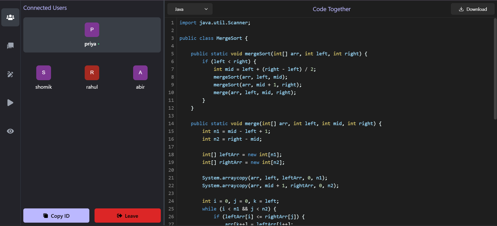
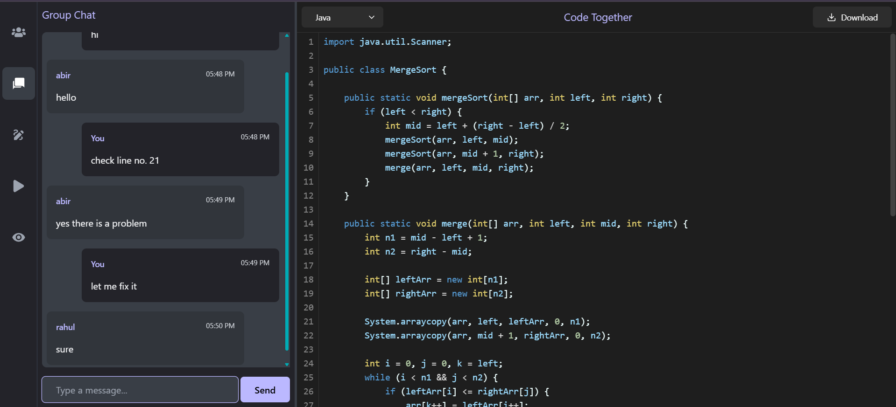

# Code Together

## Overview

The **Real-Time Collaborative Code Editor** is an online platform that enables multiple users to code together in real time. Users can create a unique room ID for collaboration, write and edit code simultaneously, and execute it live. It provides a seamless coding experience with real-time interaction, making it ideal for team-based coding and coding interviews.





## Features

- **Authentication** – Users can log in or sign up to access additional features; however, creating and joining rooms is allowed without logging in.
- **Room History** – Logged-in users can view the history of rooms they have created or joined.
- **Unique Room Creation** – Users can create unique rooms for collaboration.
- **Real-Time Code Editing** – Multiple users can edit the same code in real time.
- **Syntax Highlighting & Auto-Suggestions** – Enhances coding efficiency.
- **Live Group Chat** – Seamless communication within the room.
- **Code Compilation & Execution** – Supports live execution of code.
- **Real-Time Group Calls** – Allows audio/video calls for discussion.
- **Collaborative Drawing** – A shared whiteboard for brainstorming.
- **Preview Feature** – Users can preview their code output in real-time.
- **Download Code File** – Users can download their code file easily.
- **Multiple Language Support** – Users can write, compile, and execute code in various programming languages.

## Tech Stack

- **Frontend:** React.js
- **Backend:** Node.js, Express.js
- **Database:** MongoDB with Mongoose
- **Real-Time Communication:** Socket.io
- **Code Compilation:** Judge0 API
- **Code Editor:** Monaco
- **Whiteboard:** Tldraw


## Sequence Diagram


## Installation & Setup

1. Clone the repository:
   ```sh
   git clone https://github.com/shomik-das/CodeTogether.git
   cd CodeTogether
   ```
2. Run the frontend:
   ```sh
   cd client
   npm install
   npm run dev
   ```
4. Run the backend:
   ```sh
   cd ../server
   npm install
   npm run dev
   ```

## Contributing

Feel free to submit issues or pull requests to improve the project. Contributions are welcome!


